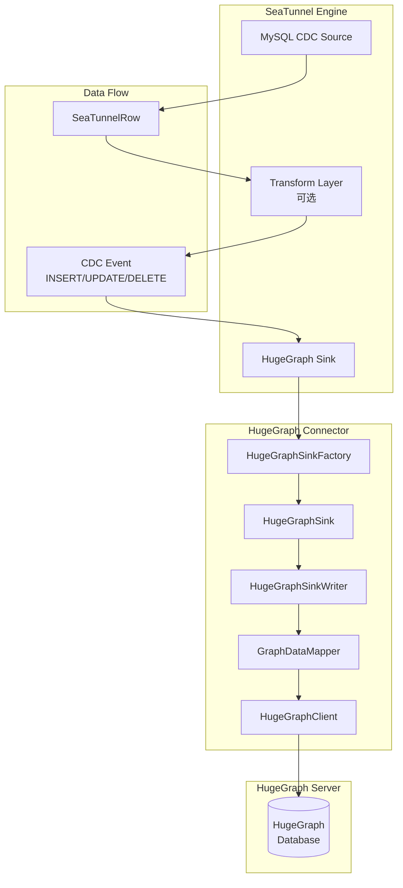
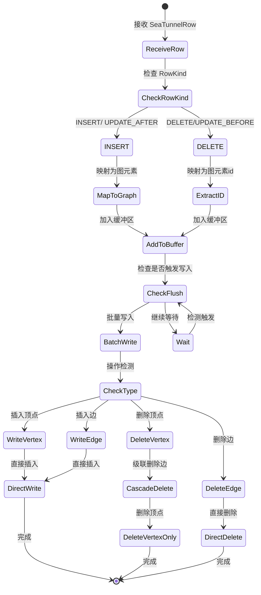

# HugeGraph 连接器设计文档

## 概述

HugeGraph 连接器是 Apache SeaTunnel v2 的一个数据集成组件，旨在实现从关系型数据库到 Apache HugeGraph 图数据库的实时数据同步。该连接器主要服务于泛安全领域的图分析场景，包括攻击溯源、告警关联网络和进程链图等应用。

### 设计目标
- **实时同步**：支持通过 CDC 机制实现增量数据同步
- **灵活映射**：提供可配置的关系型数据到图结构的映射规则
- **高可靠性**：确保数据一致性和故障恢复能力
- **易于使用**：提供直观的配置接口和丰富的示例

## 架构

### SeaTunnel 整体架构图



### 模块分层

```text
seatunnel-connectors-v2/
└── connector-hugegraph/
    ├── src/main/java/org/apache/seatunnel/connectors/seatunnel/hugegraph/
    │   ├── sink/
    │   │   ├── HugeGraphSinkFactory.java      # 工厂类
    │   │   ├── HugeGraphSink.java            # Sink 主类
    │   │   └── HugeGraphSinkWriter.java      # Writer 实现
    │   ├── config/
    │   │   ├── HugeGraphSinkConfig.java      # 配置管理
    │   │   ├── HugeGraphOptions.java         # 配置选项定义
    │   │   └── MappingConfig.java            # 映射配置
    │   ├── client/
    │   │   ├── HugeGraphClientManager.java   # 客户端管理
    │   │   └── HugeGraphWriteClient.java     # 写入客户端封装
    │   ├── mapper/
    │   │   ├── GraphDataMapper.java          # 数据映射接口
    │   │   ├── VertexMapper.java             # 顶点映射
    │   │   └── EdgeMapper.java               # 边映射
    │   ├── source/
    │   │   ├── SeaTunnelSource.java          # Source 相关
    │   │   ├── SourceSplitEnumerator.java    # Source 相关
    │   │   └── TableSourceFactory.java       # Source 相关
    │   ├── state/
    │   │   ├── HugeGraphCommitInfo.java      # 提交信息
    │   │   └── HugeGraphSinkState.java       # 状态管理
    │   ├── Validator/
    │   │   └── HugeGraphValidator.java       # 验证信息
    │   └── exception/
    │       └── HugeGraphConnectorException.java
    └── src/test/java/...                     # 测试代码
```

## 组件和接口

### 1. HugeGraphSinkFactory

```java
@AutoService(Factory.class)
public class HugeGraphSinkFactory implements TableSinkFactory {
    
    @Override
    public String factoryIdentifier() {
        return "HugeGraph";
    }
    
    @Override
    public OptionRule optionRule() {
        return OptionRule.builder()
            // 连接配置
            .required(HOST, PORT, GRAPH_NAME)
            .optional(GRAPH_SPACE, USERNAME, PASSWORD)
            // 映射配置
            .required(MAPPING_TYPE)  // vertex 或 edge
            .conditional(MAPPING_TYPE, "vertex",
                VERTEX_LABEL, VERTEX_ID_STRATEGY)
            .conditional(MAPPING_TYPE, "edge",
                EDGE_LABEL, SOURCE_VERTEX, TARGET_VERTEX)
            // 批处理配置
            .optional(BATCH_SIZE, BATCH_INTERVAL_MS)
            // 错误处理
            .optional(MAX_RETRIES, RETRY_BACKOFF_MS)
            .build();
    }
}
```

### 2. HugeGraphSink

```java
public class HugeGraphSink extends AbstractSimpleSink<SeaTunnelRow, HugeGraphSinkState> 
        implements SupportMultiTableSink {
    
    private final HugeGraphSinkConfig config;
    private final SeaTunnelRowType rowType;
    
    @Override
    public HugeGraphSinkWriter createWriter(SinkWriter.Context context) {
        return new HugeGraphSinkWriter(config, rowType, context);
    }
    
    @Override
    public Optional<SinkAggregatedCommitter> createAggregatedCommitter() {
        // 用于两阶段提交支持
        return Optional.of(new HugeGraphSinkCommitter(config));
    }
}
```

### 3. HugeGraphSinkWriter

```java
public class HugeGraphSinkWriter implements SinkWriter<SeaTunnelRow, CommitInfo, HugeGraphSinkState> {
    
    private final BatchBuffer<GraphElement> buffer;
    private final HugeGraphWriteClient client;
    private final GraphDataMapper mapper;
    
    @Override
    public void write(SeaTunnelRow row) throws IOException {
        // 根据 RowKind 处理不同的 CDC 事件
        switch (row.getRowKind()) {
            case INSERT:
            case UPDATE_AFTER:
                handleUpsert(row);
                break;
            case DELETE:
            case UPDATE_BEFORE:
                handleDelete(row);
                break;
        }
    }
    
    private void handleUpsert(SeaTunnelRow row) {
        GraphElement element = mapper.map(row);
        buffer.add(element);
        checkAndFlush();
    }
    
    private void handleDelete(SeaTunnelRow row) {
        if (config.getMappingType() == MappingType.VERTEX) {
            // 级联删除：先删除相关边，再删除顶点
            String vertexId = mapper.extractId(row);
            client.deleteVertexWithEdges(vertexId);
        } else {
            GraphElement edge = mapper.map(row);
            client.deleteEdge(edge);
        }
    }
}
```

## 数据模型

### 映射配置模型

```java
public class MappingConfig {
    // 通用配置
    private MappingType type;        // VERTEX 或 EDGE
    private String label;             // 标签名称
    
    // 顶点特定配置
    private IdStrategy idStrategy;   // CUSTOMIZE, PRIMARY_KEY
    private List<String> idFields;   // ID 字段列表
    
    // 边特定配置
    private SourceTargetConfig source;
    private SourceTargetConfig target;
    
    // 属性映射
    private Map<String, String> propertyMappings;
    private List<String> selectedFields;
    private List<String> ignoredFields;
}
```

### CDC 事件处理流程



## 错误处理

### 重试机制

```java
public class RetryableHugeGraphClient {
    
    @RetryOnFailure(maxAttempts = 3, backoffMs = 1000)
    public void batchWrite(List<GraphElement> elements) {
        try {
            client.graph(graphName).tx().commit(() -> {
                for (GraphElement element : elements) {
                    if (element instanceof Vertex) {
                        writeVertex((Vertex) element);
                    } else {
                        writeEdge((Edge) element);
                    }
                }
            });
        } catch (Exception e) {
            handleWriteError(elements, e);
        }
    }
    
    private void handleWriteError(List<GraphElement> elements, Exception e) {
        // 1. 记录失败的元素
        // 2. 决定是否重试
        // 3. 如果超过重试次数，记录到死信队列
    }
}
```

### Schema 验证

```java
public class SchemaValidator {
    
    public void validateSchema(HugeGraphClient client, MappingConfig config) {
        SchemaManager schema = client.schema();
        
        if (config.getType() == MappingType.VERTEX) {
            VertexLabel label = schema.getVertexLabel(config.getLabel());
            if (label == null) {
                throw new HugeGraphConnectorException(
                    "VertexLabel not found: " + config.getLabel());
            }
            validateProperties(label.properties(), config.getPropertyMappings());
        } else {
            EdgeLabel label = schema.getEdgeLabel(config.getLabel());
            if (label == null) {
                throw new HugeGraphConnectorException(
                    "EdgeLabel not found: " + config.getLabel());
            }
            validateSourceTarget(label, config);
        }
    }
}
```

## 测试策略

### 测试覆盖范围

1. **单元测试**
    - 映射逻辑测试
    - 配置解析测试
    - 缓冲区管理测试

2. **集成测试**
    - 使用 Testcontainers 启动 HugeGraph
    - CDC 事件处理测试
    - 级联删除测试
    - 批量写入测试

3. **端到端测试**
    - MySQL → SeaTunnel → HugeGraph 完整流程
    - 性能测试（100万条记录）
    - 故障恢复测试

### 测试示例

```java
@Test
public void testCascadeDelete() {
    // 准备：创建顶点和边
    writer.write(createVertex("v1"));
    writer.write(createEdge("v1", "v2"));
    writer.write(createEdge("v1", "v3"));
    writer.flush();
    
    // 执行：删除顶点
    SeaTunnelRow deleteRow = createDeleteRow("v1");
    writer.write(deleteRow);
    writer.flush();
    
    // 验证：顶点和相关边都被删除
    assertNull(client.getVertex("v1"));
    assertNull(client.getEdge("v1", "v2"));
    assertNull(client.getEdge("v1", "v3"));
}
```

## 配置示例

### 基础顶点同步配置

```hocon
sink {
  HugeGraph {
    # 连接配置
    host = "localhost"
    port = 8080
    graph = "hugegraph"
    
    # 映射配置
    mapping_type = "vertex"
    vertex_label = "person"
    vertex_id_strategy = "PRIMARY_KEY"
    id_fields = ["user_id"]
    
    # 属性映射
    property_mappings {
      name = "user_name"
      age = "user_age"
      city = "location"
    }
    
    # 批处理配置
    batch_size = 500
    batch_interval_ms = 5000
  }
}
```

### CDC 增量同步配置

```hocon
source {
  MySQL-CDC {
    hostname = "localhost"
    port = 3306
    database-name = "test"
    table-name = "users"
    # CDC 配置...
  }
}

sink {
  HugeGraph {
    host = "localhost"
    port = 8080
    graph = "security_graph"
    
    mapping_type = "vertex"
    vertex_label = "user"
    vertex_id_strategy = "CUSTOMIZE"
    id_fields = ["id"]
    
    # CDC 相关配置
    enable_cascade_delete = true
    max_retries = 3
    retry_backoff_ms = 1000
  }
}
```

### 边映射配置

```hocon
sink {
  HugeGraph {
    host = "localhost"
    port = 8080
    graph = "hugegraph"
    
    mapping_type = "edge"
    edge_label = "knows"
    
    # 源顶点配置
    source_vertex {
      label = "person"
      id_fields = ["from_user_id"]
    }
    
    # 目标顶点配置
    target_vertex {
      label = "person"
      id_fields = ["to_user_id"]
    }
    
    # 边属性
    property_mappings {
      weight = "relationship_score"
      since = "created_date"
    }
  }
}
```

## 性能优化考虑

1. **批量写入优化**
    - 使用 HugeGraph 批量 API
    - 实现混合触发策略（记录数 + 时间窗口）
    - 支持并发写入（线程池）

2. **内存管理**
    - 使用环形缓冲区避免频繁 GC
    - 实现背压机制防止 OOM

3. **连接池管理**
    - 复用 HTTP 连接
    - 合理配置连接池大小

## 未来扩展

1. **Phase 2: Source 实现**
    - 支持从 HugeGraph 读取数据
    - 支持 Gremlin 查询

2. **Phase 3: 高级特性**
    - 支持自动 Schema 创建
    - 支持自定义 ID 生成策略
    - 支持多图空间并行写入
    - 支持 OLAP 查询集成

## 实现方案对比分析

### Neo4j 连接器实现方式

Neo4j 连接器采用了 **Cypher 查询语言** 的实现方式：

#### 特点
1. **基于 Cypher 语句**
    - 用户直接配置 Cypher 查询模板
    - 通过参数占位符映射数据字段
    - 示例：`CREATE (n:Person {name: $name, age: $age})`

2. **配置方式**
   ```hocon
   sink {
     Neo4j {
       uri = "bolt://localhost:7687"
       database = "neo4j"
       query = "MERGE (n:Person {id: $id}) SET n.name = $name"
       queryParamPosition = {
         id = 0
         name = 1  
       }
     }
   }
   ```

#### 优缺点
**优点**：
- ✅ 灵活性高：用户可以编写任意复杂的 Cypher 语句
- ✅ 语义清晰：Cypher 语句直观表达图操作意图

**缺点**：
- ❌ 学习成本：用户需要掌握 Cypher 语法
- ❌ 配置复杂：需要手动编写查询和参数映射
- ❌ CDC 支持弱：需要用户自行处理不同 RowKind 的语句

### HugeGraph Client API 实现方式

#### 特点
1. **基于 Java Client API**
    - 使用 HugeGraph Java Client SDK
    - 通过 API 调用操作图数据
    - 示例：`graph.addVertex(T.label, "person", "name", name)`

2. **配置方式（我们的设计）**
   ```hocon
   sink {
     HugeGraph {
       host = "localhost"
       port = 8080
       graph = "hugegraph"
       
       mapping_type = "vertex"
       vertex_label = "person"
       property_mappings {
         name = "user_name"
       }
     }
   }
   ```

#### 优缺点
**优点**：
- ✅ 易于使用：声明式配置，无需学习查询语言
- ✅ 类型安全：编译时类型检查
- ✅ CDC 原生支持：框架层面处理 RowKind
- ✅ 错误处理好：明确的异常类型和错误信息

**缺点**：
- ❌ 灵活性受限：只能支持预定义的操作模式

### 我们的选择：Client API 方式

**选择理由**：
1. **符合 MVP 原则**：快速交付核心功能
2. **满足业务需求**：覆盖泛安全领域的数据同步场景
3. **降低用户门槛**：声明式配置，无需学习额外查询语言
4. **CDC 原生支持**：框架层处理 RowKind，减少用户配置复杂度

### 从 Neo4j 实现中的关键借鉴

虽然实现方式不同，但 Neo4j 连接器有很多值得借鉴的工程实践：

#### 1. 批处理实现（重点借鉴）
```java
// Neo4j 的批处理缓冲区管理
private final List<SeaTunnelRowNeo4jValue> writeBuffer;
private final Integer maxBatchSize;

private void tryWriteByBatchSize() {
    if (!writeBuffer.isEmpty() && writeBuffer.size() >= maxBatchSize) {
        writeByBatch();
        writeBuffer.clear();
    }
}
```

#### 2. 配置验证机制
- 启动时验证连接可用性
- 参数完整性检查
- 清晰的错误提示

#### 3. Writer 生命周期管理
- prepareCommit() 处理事务提交
- close() 确保资源释放
- flushWriteBuffer() 处理残余数据

#### 4. 测试框架搭建
- 使用 Testcontainers 启动真实数据库
- 完整的 E2E 测试用例

## MVP 实现路线图

### Phase 1：MVP 核心功能（当前目标）

**目标**：快速交付可用的 HugeGraph Sink

**核心功能**：
1. ✅ 基于 Client API 的数据写入
2. ✅ CDC 事件处理（INSERT/UPDATE/DELETE）
3. ✅ 级联删除支持
4. ✅ 声明式映射配置
5. ✅ 批量写入优化（借鉴 Neo4j）
6. ✅ 基础错误重试

**技术决策**：
- 使用 HugeGraph Java Client 1.5
- 简单直观的配置模式
- 借鉴 Neo4j 的批处理和测试实践

**不包含**（避免过度设计）：
- ❌ Gremlin 查询支持
- ❌ 自动 Schema 创建
- ❌ 复杂的 ID 生成策略
- ❌ 高级性能优化

### Phase 2：功能增强（未来）
- Source 实现
- 性能优化（连接池、并发写入）
- Schema 自动创建
- 监控指标完善

### Phase 3：高级特性（仅在强烈需求时考虑）
- Gremlin 查询支持
- 自定义 ID 生成策略
- 复杂图模式匹配

## 设计决策和理由

1. **为什么选择 Client API 而非 Cypher/Gremlin**
    - 降低用户学习成本
    - 更好的 CDC 支持
    - 符合 MVP 快速交付原则

2. **为什么选择 SinkAggregatedCommitter**
    - 提供更强的一致性保证
    - 便于实现分布式事务
    - 符合 SeaTunnel 最佳实践

3. **为什么实现级联删除**
    - 保证图数据完整性
    - 避免悬空边
    - 符合图数据库语义

4. **为什么采用混合批处理策略**
    - 平衡延迟和吞吐量
    - 适应不同负载模式
    - 提供灵活的配置选项

5. **为什么分离映射逻辑**
    - 提高代码可维护性
    - 便于扩展新的映射规则
    - 支持复杂的转换场景
